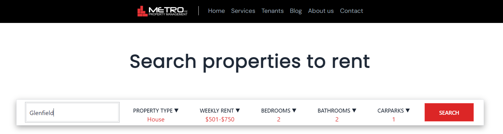
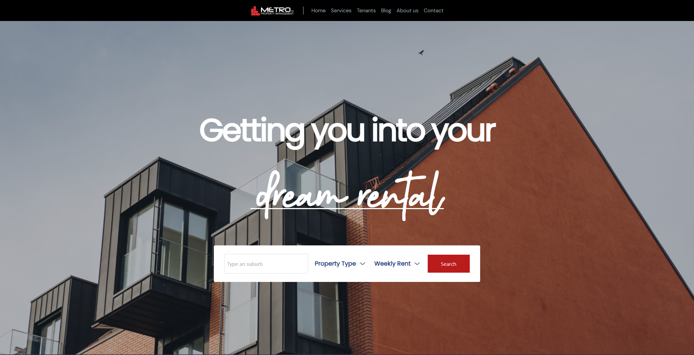

<!-- PROJECT LOGO -->

<!-- PROJECT SHIELDS -->

[![Contributors][contributors-shield]][contributors-url]

Devs: 
Luis Rodríguez | Alan Soto  

[![GitHub - Luis Rodríguez][Github.logo]][luis-github-url] [![GitHub - Alan Soto][Github.logo]][alan-github-url]

[![Contributors][contributors-shield]][contributors-url]

UX:  
Michael Sherrell | Nicola Pfister

  
<h3 align="center">Real Estate Website Project</h3>

  

  Welcome to the Real Estate Website project! In this collaborative effort, we teamed up with two talented UX designers, Michael and Nicola, to transform their brilliant ideas into a fully functional web application. Our goal was to create an engaging and user-friendly platform for a real estate business, providing users with an exceptional experience when searching for their dream properties. 
     
    <a href="https://github.com/WeisshorNz/L5-Mission05"><strong>Explore the docs »</strong></a>

  

<!-- TABLE OF CONTENTS -->

  
Table of Contents

  <ol>
    <li>
      <a href="#about-the-project">About The Project</a>
      <ul>
        <li><a href="#built-with">Built With</a></li>
      </ul>
    </li>
    <li>
      <a href="#getting-started">Getting Started</a>
      <ul>
        <li><a href="#prerequisites">Prerequisites</a></li>
        <li><a href="#installation">Installation</a></li>
      </ul>
    </li>
    <li><a href="#contact">Contact</a></li>
    <li><a href="#acknowledgments">Acknowledgments</a></li>
  </ol>

<!-- ABOUT THE PROJECT -->

## About The Project

(<a href="#readme-top">back to top</a>)

### Features

Homepage: We designed and implemented an eye-catching and informative homepage that welcomes users to the real estate platform. It provides an overview of the available properties, enticing users to explore further.

Search Results Page: In this page users can search for their desired properties using a user-friendly search bar. When a search query is entered, the data is sent to the backend for processing.

Backend Processing: To ensure efficient data retrieval, we built a robust backend that handles incoming search requests. An API processes the fetch request and communicates with the MongoDB database to retrieve relevant property listings.

Responsive Design: We paid special attention to the user experience across all devices. The website is fully responsive, ensuring that users can access and navigate it seamlessly on small screens, such as mobile devices and tablets.

### Built With

- [![MongoDB][MongoDB.logo]][MongoDB-url]
- [![Node.js][Node.js.logo]][Nodejs-url]
- [![React][React.js]][React-url]

(<a href="#readme-top">back to top</a>)

<!-- GETTING STARTED -->

## Getting Started

### Prerequisites

To use the application, follow these steps:

- Ensure that Node.js and npm are installed on your machine.

### Installation

1. Clone the Repository: Clone this repository to your local machine using your preferred method.
2. Install Dependencies: Navigate to the project directory and install the required dependencies for both the frontend and backend using npm or yarn.

3. Set Up the Database: Ensure that you have a MongoDB instance set up and configure the connection in the backend.

4. Run the Application: Start both the frontend and backend servers. You can typically do this using npm or yarn scripts.

5. Explore the Website: Open your web browser and navigate to the specified URL to access the Real Estate Website. Explore the homepage, use the search bar, and experience the search results.

(<a href="#readme-top">back to top</a>)

<!-- CONTACT -->

## Contact

Luis Rodríguez - luis@missionreadyhq.com

- [![LinkedIn - Luis Rodriguez][linkedin-shield]][luis-linkedin-url]
    

  Alan Soto - alans@missionreadyhq.com

- [![LinkedIn - Alan Soto][linkedin-shield]][alan-linkedin-url]
    

  Michael Sherrell - michaels@missionreadyhq.com

- [![LinkedIn - Michael Sherrell][linkedin-shield]][michael-linkedin-url]
    

  Nicola Pfister - nicola@missionreadyhq.com

- [![LinkedIn - Nicola Pfister][linkedin-shield]][nicola-linkedin-url]
    

  Project Link: [https://github.com/WeisshorNz/L5-Mission5](https://github.com/WeisshorNz/L5-Mission05)

(<a href="#readme-top">back to top</a>)

<!-- ACKNOWLEDGMENTS -->

## Acknowledgments

- [Best README Template](https://github.com/othneildrew/Best-README-Template/tree/master)

(<a href="#readme-top">back to top</a>)

<!-- MARKDOWN LINKS & IMAGES -->

[contributors-shield]: https://img.shields.io/github/contributors/WeisshorNz/L5-Mission2.svg?style=for-the-badge
[contributors-url]: https://github.com/WeisshorNz/L5-Mission05/graphs/contributors
[linkedin-shield]: https://img.shields.io/badge/-LinkedIn-black.svg?style=for-the-badge&logo=linkedin&colorB=555
[Github.logo]: https://img.shields.io/badge/GitHub-100000?style=for-the-badge&logo=github&logoColor=white
[luis-github-url]: https://github.com/WeisshorNz
[alan-github-url]: https://github.com/AlanISoto
[luis-linkedin-url]: www.linkedin.com/in/luis-rodríguez-4b4678290
[alan-linkedin-url]: https://www.linkedin.com/in/alan-ivan-soto-871630224/
[michael-linkedin-url]: https://www.linkedin.com/in/michael-sherrell-37402250/
[nicola-linkedin-url]: https://www.linkedin.com/in/nicola-pfister/
[product-screenshot]: images/screenshot.png
[React.js]: https://img.shields.io/badge/React-20232A?style=for-the-badge&logo=react&logoColor=61DAFB
[React-url]: https://reactjs.org/
[Nodejs-url]: https://nodejs.org/en
[Node.js.logo]: https://img.shields.io/badge/Node.js-43853D?style=for-the-badge&logo=node.js&logoColor=white
[Azure-url]: https://azure.microsoft.com/en-us
[Azure.logo]: https://img.shields.io/badge/Azure-0078D4?style=for-the-badge&logo=microsoftazure&logoColor=white
[MongoDB-url]: https://www.mongodb.com/
[MongoDB.logo]: https://img.shields.io/badge/MongoDB-4EA94B?style=for-the-badge&logo=mongodb&logoColor=white
